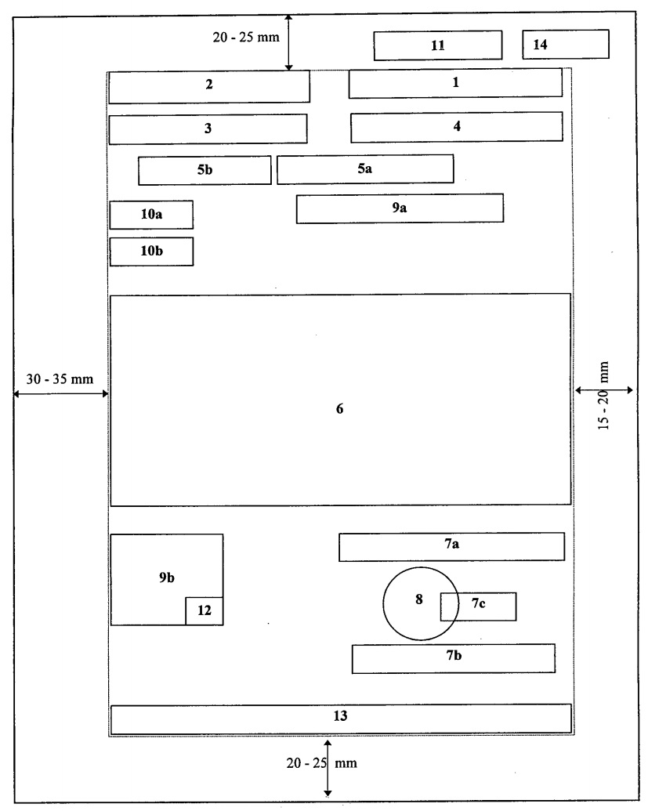

# Quy luật layout các thành phần thể thức văn bản hành chính

## 1. Mục đích và nguồn

Tài liệu này chuyển sơ đồ bố trí thành phần thể thức văn bản hành chính thành
các quy luật định vị có thể dùng làm tín hiệu cho OCR, layout analysis và KIE.
Phạm vi gồm các ô `1` đến `10b` và dấu `ĐẾN` dùng để lấy `receiverDate`.

Nguồn đối chiếu chính:

- [Nghị định 30/2020/NĐ-CP, Phụ lục I, Phần I, Mục II-IV](https://luatvietnam.vn/hanh-chinh/nghi-dinh-30-2020-nd-cp-ve-cong-tac-van-thu-moi-nhat-181212-d1.html).
- Sơ đồ bố trí thành phần thể thức do người dùng cung cấp, tương ứng Mục IV.2
  của Phụ lục I.
- Mẫu dấu `ĐẾN` tại Phụ lục IV, Mục V của cùng Nghị định.
- Các field đầu ra trong [`prediction_schema.json`](./prediction_schema.json).



_Sơ đồ gốc tại Mục IV.2, Phần I, Phụ lục I Nghị định 30/2020/NĐ-CP._

Các vị trí và quan hệ trình bày được dẫn từ Nghị định. Những khoảng tọa độ
chuẩn hóa trong tài liệu này là **heuristic tìm kiếm cho OCR**, được suy ra từ
sơ đồ và các quan hệ đó; chúng không phải kích thước hay giới hạn bắt buộc theo
pháp luật.

## 2. Hệ tọa độ và nguyên tắc áp dụng

### 2.1. Hệ tọa độ chuẩn hóa

Trước khi áp dụng quy luật, trang phải được nhận diện đúng chiều và sửa xoay,
nghiêng. Với trang có chiều rộng `W`, chiều cao `H`, hộp bao pixel
`(left, top, right, bottom)` được chuẩn hóa thành:

```text
x0 = left / W      y0 = top / H
x1 = right / W     y1 = bottom / H
```

Do đó `x0, y0, x1, y1` đều thuộc `[0, 1]`, gốc tọa độ ở góc trên bên trái,
`x` tăng từ trái sang phải và `y` tăng từ trên xuống dưới. Tọa độ được tính
theo **toàn trang**, không tính riêng theo vùng nội dung.

Theo Nghị định, bố cục chuẩn dùng giấy A4 dọc; lề trên và dưới `20-25 mm`, lề
trái `30-35 mm`, lề phải `15-20 mm`. Trường hợp bảng, biểu được trình bày ngang
thì không áp dụng trực tiếp các khoảng `x` dưới đây nếu chưa đưa trang về một
hệ quy chiếu tương ứng.

### 2.2. Ba vai trò trang

- **Trang đầu:** ưu tiên tìm các ô `1`, `2`, `3`, `4`, `5a` hoặc `5b`, `9a`,
  `10a`, `10b`, dấu `ĐẾN` nếu có và phần bắt đầu của ô `6`.
- **Trang nội dung:** chủ yếu là ô `6`; không được gán tiêu đề đầu trang, số
  trang hoặc header/footer lặp lại vào nội dung nghiệp vụ.
- **Trang ký/cuối:** chứa phần cuối ô `6`, cụm `7a-7c`, ô `8` và `9b`. Với văn
  bản một trang, trang đầu đồng thời là trang ký/cuối.

Các cửa sổ tìm kiếm có chủ ý chồng lấn. Thứ tự ưu tiên khi phân loại block là:

1. Từ khóa hoặc mẫu văn bản đặc trưng.
2. Quan hệ với các block đã nhận diện chắc chắn.
3. Trang xuất hiện và thứ tự đọc.
4. Cửa sổ tọa độ chuẩn hóa.

Không loại một block chỉ vì một phần hộp bao nằm ngoài cửa sổ gợi ý.

## 3. Bảng quy luật OCR/KIE thống nhất

Ký hiệu `[a, b]` trong cột vùng tìm kiếm là khoảng mềm cho `x` hoặc `y`. Các
khoảng được cố ý mở rộng để chịu được xuống dòng, scan lệch nhẹ và khác biệt
template.

| Ô             | Thành phần                                    | Trang và vị trí/quan hệ neo                                                                                                                                      | Vùng tìm kiếm mềm `(x, y)`       | Dấu hiệu nhận diện và biến thể                                                                                                                                                                              | Field benchmark                                                                                              |
| ------------- | --------------------------------------------- | ---------------------------------------------------------------------------------------------------------------------------------------------------------------- | -------------------------------- | ----------------------------------------------------------------------------------------------------------------------------------------------------------------------------------------------------------- | ------------------------------------------------------------------------------------------------------------ |
| `1`           | Quốc hiệu và Tiêu ngữ                         | Trên cùng, nửa phải trang đầu. Cùng hàng với `2`; `4` nằm dưới và canh giữa theo `1`.                                                                            | `x=[0.50,0.93]`, `y=[0.03,0.20]` | Hai dòng chính: `CỘNG HÒA XÃ HỘI CHỦ NGHĨA VIỆT NAM` và `Độc lập - Tự do - Hạnh phúc`; có đường kẻ dưới Tiêu ngữ. Đây là anchor mạnh để xác định đầu trang và cột phải.                                     | Không có field trực tiếp; dùng làm anchor/kiểm tra loại bố cục.                                              |
| `2`           | Tên cơ quan, tổ chức ban hành                 | Trên cùng, nửa trái trang đầu. Cùng hàng với `1`; `3` nằm dưới và canh giữa theo `2`.                                                                            | `x=[0.12,0.52]`, `y=[0.03,0.20]` | Có thể gồm cơ quan chủ quản ở trên và cơ quan ban hành ở dưới; có thể xuống nhiều dòng. Tên cơ quan ban hành thường in hoa, đậm và có đường kẻ dưới; không đảo thứ tự đọc các dòng.                         | `officeSender`                                                                                               |
| `3`           | Số, ký hiệu văn bản                           | Nửa trái, ngay dưới `2`; cùng dòng bố cục với `4`.                                                                                                               | `x=[0.12,0.52]`, `y=[0.12,0.28]` | Anchor `Số:`; mã thường chứa chữ số, `/`, `-` và nhóm chữ viết tắt. Không lấy số trang hoặc số trong nội dung.                                                                                              | `code`                                                                                                       |
| `4`           | Địa danh và thời gian ban hành                | Nửa phải, ngay dưới `1`; cùng dòng với `3` và canh giữa theo `1`.                                                                                                | `x=[0.50,0.93]`, `y=[0.12,0.28]` | Mẫu thường gặp: `<địa danh>, ngày ... tháng ... năm ...`; chữ nghiêng. Tách địa danh và ngày nhưng giữ chúng thuộc cùng một block nguồn.                                                                    | `province`, `documentDate`                                                                                   |
| `5a`          | Tên loại và trích yếu của văn bản có tên loại | Nằm dưới cụm `3/4`, canh giữa theo toàn vùng trình bày; đứng trước `6`. Loại trừ lẫn nhau với `5b` trong cùng một văn bản.                                       | `x=[0.20,0.84]`, `y=[0.18,0.38]` | Tên loại in hoa, đậm; trích yếu nằm ngay dưới, thường đậm; có thể có đường kẻ dưới trích yếu. Hai dòng phải được tách theo vai trò, không gộp tên loại vào `title`.                                         | `type`, `title`                                                                                              |
| `5b`          | Trích yếu Công văn                            | Nửa trái, dưới `3`, cách dòng với số/ký hiệu; đứng trước `9a` hoặc `6`. Không dùng đồng thời với `5a`.                                                           | `x=[0.12,0.55]`, `y=[0.18,0.35]` | Bắt đầu bằng `V/v`, sau đó là trích yếu. `V/v` là marker, không phải toàn bộ giá trị `title`. Từ `Công văn` thường không được in như tên loại tại đây.                                                      | `title`; `type = Công văn` là kết quả phân loại từ cấu trúc/mã, không phải text được chép trực tiếp từ `5b`. |
| `9a`          | Nơi nhận ở đầu văn bản (`Kính gửi`)           | Sau `5a/5b` và trước phần nội dung chính. Thường nằm quanh giữa chiều ngang thay vì sát lề trái. Áp dụng cho Công văn và Tờ trình/Báo cáo cấp dưới gửi cấp trên. | `x=[0.28,0.88]`, `y=[0.24,0.48]` | Anchor `Kính gửi:`. Một nơi nhận có thể ở cùng dòng; nhiều nơi nhận xuống dòng, thường có gạch đầu dòng. Không gộp `Kính gửi:` vào giá trị nơi nhận.                                                        | `first_recipients`                                                                                           |
| `10a`         | Dấu chỉ độ mật                                | Vùng trên bên trái trang đầu, ở mép trái của cụm tiêu đề/nội dung; là block tùy chọn.                                                                            | `x=[0.00,0.24]`, `y=[0.14,0.34]` | Dấu đóng với một trong các nhãn `MẬT`, `TỐI MẬT`, `TUYỆT MẬT`; có thể có màu đỏ, nhiễu hoặc lệch nhẹ do đóng dấu. Phân biệt với dấu cơ quan ở `8`.                                                          | `security_level`                                                                                             |
| `10b`         | Dấu chỉ mức độ khẩn                           | Ngay dưới `10a` trong vùng trên bên trái; là block tùy chọn và có thể xuất hiện khi `10a` vắng mặt.                                                              | `x=[0.00,0.24]`, `y=[0.20,0.40]` | Dấu hình chữ nhật với `KHẨN`, `THƯỢNG KHẨN` hoặc `HỎA TỐC`, thường màu đỏ. Không nhầm với các từ tương tự trong nội dung.                                                                                   | `priority_level`                                                                                             |
| Không đánh số | Dấu `ĐẾN` của cơ quan tiếp nhận               | Thường được đóng trên trang đầu sau khi cơ quan nhận tiếp nhận văn bản. Vị trí phụ thuộc khoảng trống còn lại và không bị ràng buộc bởi sơ đồ ô `1-14`.          | Không dùng cửa sổ tọa độ cố định | Khung chữ nhật có tên cơ quan tiếp nhận, chữ `ĐẾN` và trường `Ngày:`; có thể có `Giờ:`, `Số:`, `Chuyển:` hoặc số hồ sơ. Ngày ghi sau `Ngày:` là ngày nhận, không phải ngày ban hành.                        | `receiverDate`                                                                                               |
| `6`           | Nội dung văn bản                              | Sau `5a/5b` và `9a` nếu có; trải gần toàn chiều rộng vùng trình bày và có thể tiếp tục qua nhiều trang. Kết thúc trước cụm ký/nhận ở trang cuối.                 | `x=[0.12,0.93]`, `y=[0.28,0.90]` | Văn xuôi hoặc cấu trúc phần/chương/mục/điều/khoản; có thể chứa bảng. Ranh giới dưới phải suy ra từ `7a`/`9b`, không dùng một ngưỡng `y` cứng.                                                               | Không có field trực tiếp; dùng để phân đoạn và loại nội dung khỏi các field metadata.                        |
| `7a`          | Quyền hạn, chức vụ của người ký               | Nửa phải trang ký/cuối, ngay sau nội dung; nằm trên `7c` và `7b`. Dòng đầu thường ngang với tiêu đề `Nơi nhận:` của `9b`.                                        | `x=[0.50,0.93]`, `y=[0.62,0.84]` | Có thể bắt đầu bằng `TM.`, `Q.`, `KT.`, `TL.`, `TUQ.`; quyền hạn/chức vụ thường in hoa, đậm và canh giữa. Có thể có nhiều cụm ký.                                                                           | `signer_title`                                                                                               |
| `7c`          | Chữ ký của người có thẩm quyền                | Nằm giữa `7a` và phần họ tên trong `7b`, canh giữa theo cụm ký; có thể bị ô `8` chồng lên bên trái.                                                              | `x=[0.52,0.93]`, `y=[0.68,0.91]` | Nét ký tay hoặc ảnh chữ ký số, thường ít hoặc không có text OCR. Không dùng nét ký làm giá trị `signer`.                                                                                                    | Không có field text trực tiếp; dùng làm anchor giữa `signer_title` và `signer`.                              |
| `8`           | Dấu/chữ ký số của cơ quan, tổ chức            | Trong cụm ký ở trang cuối; dấu cơ quan trùm khoảng `1/3` bên trái chữ ký của người có thẩm quyền.                                                                | `x=[0.45,0.80]`, `y=[0.67,0.92]` | Thường là dấu tròn màu đỏ hoặc ảnh chữ ký số. Cho phép giao cắt hình học với `7c`; không ép detector tách hai vùng thành các hộp không chồng lấn.                                                           | Không có field trực tiếp; dùng làm anchor/xác thực cụm ký.                                                   |
| `7b`          | Chức vụ khác và họ tên người ký               | Nửa phải trang ký/cuối, dưới `7c`; họ tên canh giữa theo `7a`. Chức vụ khác, nếu có, nằm trên họ tên trong cùng vùng.                                            | `x=[0.50,0.93]`, `y=[0.76,0.96]` | Họ tên thường in thường, đậm. Phải tách dòng chức vụ bổ sung khỏi dòng họ tên; với nhiều người ký, giữ thứ tự trên xuống dưới rồi trái sang phải.                                                           | Phần chức vụ bổ sung → `signer_title`; phần họ tên → `signer`.                                               |
| `9b`          | Nơi nhận cuối văn bản                         | Nửa trái trang ký/cuối, sau nội dung; tiêu đề thường ngang hàng với `7a`.                                                                                        | `x=[0.12,0.52]`, `y=[0.64,0.96]` | Anchor `Nơi nhận:`; danh sách thường bắt đầu bằng `-`, có thể có `Như trên` và kết thúc bằng dòng `Lưu:`. Không đưa dòng lưu nội bộ vào `recipients` nếu quy ước nhãn chỉ lấy cơ quan/tổ chức/cá nhân nhận. | `recipients`                                                                                                 |

### 3.1. Diễn giải hai dấu tùy chọn `10a` và `10b`

Tầng nhận diện có thể lưu riêng trạng thái có dấu và đọc được, có vùng nghi là
dấu nhưng không đọc chắc chắn, hoặc không phát hiện dấu để phục vụ debug. Đầu
ra benchmark luôn ánh xạ theo bảng sau:

| Text quan sát được                       | Giá trị enum                         |
| ---------------------------------------- | ------------------------------------ |
| `MẬT`                                    | `1_MẬT`                              |
| `TỐI MẬT`                                | `2_TỐI MẬT`                          |
| `TUYỆT MẬT`                              | `3_TUYỆT MẬT`                        |
| `HỎA TỐC`                                | `1_HỎA TỐC`                          |
| `KHẨN`                                   | `2_KHẨN`                             |
| `THƯỢNG KHẨN`                            | `3_THƯỢNG KHẨN`                      |
| Không có hoặc không đọc được dấu độ mật  | `0_BÌNH THƯỜNG` cho `security_level` |
| Không có hoặc không đọc được dấu độ khẩn | `0_BÌNH THƯỜNG` cho `priority_level` |

`0_BÌNH THƯỜNG` là fallback theo contract benchmark, không phải text được OCR
trực tiếp từ PDF. Trạng thái phát hiện nội bộ vẫn nên được giữ trong log để
phân biệt “không có dấu” với “ảnh có dấu nhưng không đọc được”.

### 3.2. Dấu `ĐẾN` và `receiverDate`

Dấu `ĐẾN` không thuộc ô nào trong sơ đồ bố trí thành phần thể thức tại Phụ lục
I. Đây là dấu nghiệp vụ do **cơ quan tiếp nhận** đóng thêm khi xử lý văn bản
đến; mẫu dấu được quy định riêng tại Phụ lục IV. Vì vậy không được gán dấu này
vào ô `4`, `8`, `10a` hoặc `10b`.

Quy tắc trích xuất:

1. Tìm một khung dấu có anchor `ĐẾN` và `Ngày:`; tên cơ quan nhận thường nằm ở
   đầu khung. `Giờ:`, `Số:`, `Chuyển:` và số hồ sơ là các tín hiệu phụ.
2. Lấy phần ngày ngay sau `Ngày:` và chuẩn hóa về `dd/mm/yyyy`.
3. Gán ngày này cho `receiverDate`; ngày trong ô `4` chỉ gán cho
   `documentDate`.
4. Nếu không phát hiện dấu hoặc không nhận diện được ngày thì trả
   `receiverDate.value = ""`.

## 4. Quan hệ bố cục toàn cục

### 4.1. Cụm đầu trang

- `2` và `1` tạo thành hai cột trái/phải ở đầu trang.
- `3` neo dưới `2`; `4` neo dưới `1`; `3` và `4` được kỳ vọng gần cùng hàng.
- Với văn bản có tên loại, `5a` canh giữa theo toàn vùng trình bày, không chỉ
  theo một cột.
- Với Công văn, `5b` neo dưới `3`; không tìm một block tên loại ở giữa trang.
- `9a`, nếu có, nằm sau trích yếu và trước `6`.
- `10a/10b` là các dấu bổ sung. Sự vắng mặt của chúng không làm hỏng cấu trúc
  `1-6`.

### 4.2. Cụm cuối văn bản

- `9b` ở bên trái và cụm ký `7a-7c` ở bên phải; hai cụm có thể bắt đầu gần
  cùng cao độ.
- Trong cụm ký, thứ tự dọc chuẩn là `7a` → `7c` → họ tên trong `7b`.
- `8` được phép chồng lên `7c`; giao cắt này là bằng chứng tích cực chứ không
  phải lỗi layout.
- Nếu có nhiều người ký, mỗi cụm ký được gom riêng trước khi nối các giá trị
  `signer_title` và `signer` theo thứ tự trên xuống dưới, trái sang phải.

### 4.3. Thứ tự đọc logic

Thứ tự đọc metadata khuyến nghị không hoàn toàn giống thứ tự quét OCR theo
dòng:

```text
2 → 1 → 3 → 4 → (5a | 5b) → 9a? → 6 → 9b → 7a → 7c/8 → 7b
```

Dấu `?` biểu thị block tùy chọn; `(5a | 5b)` biểu thị hai cấu trúc loại trừ lẫn
nhau. `10a/10b` được dò như lớp dấu độc lập trong vùng đầu trang vì chúng có
thể chen vào khoảng trắng và không thuộc luồng đọc nội dung.

## 5. Mapping sang schema và giới hạn trích xuất

| Field              | Nguồn layout                                               | Quy tắc biên                                                                                    |
| ------------------ | ---------------------------------------------------------- | ----------------------------------------------------------------------------------------------- |
| `type`             | `5a`, hoặc phân loại cấu trúc Công văn từ `5b` kết hợp `3` | Không lấy một tiêu đề chương trong `6` làm loại văn bản.                                        |
| `title`            | Trích yếu trong `5a` hoặc phần sau `V/v` trong `5b`        | Không bỏ marker `V/v` nếu quy ước nhãn không yêu cầu.                                           |
| `code`             | `3`                                                        | Giữ các dấu cấu trúc `/`, `-`.                                                                  |
| `documentDate`     | Phần ngày trong `4`                                        | Không nhầm với ngày được viện dẫn trong `6` hoặc ngày nhận văn bản.                             |
| `officeSender`     | `2`                                                        | Giữ thứ tự hiển thị từ trên xuống dưới; không đảo cơ quan chủ quản/cơ quan ban hành.            |
| `first_recipients` | `9a`                                                       | Chỉ lấy tên đối tượng nhận, giữ thứ tự trình bày.                                               |
| `recipients`       | `9b`                                                       | Tách danh sách nhận khỏi nhãn `Nơi nhận:` và dữ liệu lưu nội bộ theo quy ước benchmark.         |
| `signer_title`     | `7a` và phần chức vụ bổ sung trong `7b`                    | Không lấy chữ ký hoặc con dấu làm text chức vụ.                                                 |
| `signer`           | Phần họ tên trong `7b`                                     | Không suy đoán họ tên từ nét ký tay.                                                            |
| `province`         | Phần địa danh trong `4`                                    | Không tự động dùng địa chỉ cơ quan ở chân trang thay thế.                                       |
| `security_level`   | `10a`                                                      | Không đọc nhãn độ mật từ nội dung thân văn bản.                                                 |
| `priority_level`   | `10b`                                                      | Không đọc từ “khẩn” xuất hiện ngẫu nhiên trong nội dung.                                        |
| `receiverDate`     | Dấu `ĐẾN` không đánh số của cơ quan tiếp nhận              | Lấy ngày sau anchor `Ngày:`; không lấy ngày ở `4`. Không phát hiện/không đọc được thì trả `""`. |

Các ô `1`, `6`, `7c` và `8` không có field text đầu ra tương ứng trong schema
hiện tại, nhưng vẫn cần được phát hiện hoặc ước lượng để phân đoạn đúng và giảm
gán nhầm.

## 6. Giới hạn và fallback

- Block có thể co giãn, xuống nhiều dòng hoặc dịch theo chiều dọc do độ dài
  nội dung; quan hệ neo quan trọng hơn tọa độ tuyệt đối.
- Scan có thể bị nghiêng, crop mất lề, biến dạng phối cảnh, nhiễu màu hoặc có
  con dấu/chữ ký chồng text. Khi chưa sửa hình học, không dùng tọa độ chuẩn hóa
  để loại ứng viên.
- Văn bản chuyên ngành, văn bản cũ, bản sao, phụ lục, biểu mẫu doanh nghiệp
  hoặc template tự thiết kế có thể không tuân thủ đầy đủ sơ đồ này.
- Các block `9a`, `10a`, `10b`, dấu `ĐẾN` và chức vụ bổ sung trong `7b` có thể
  vắng mặt. Log nội bộ nên phân biệt block vắng mặt với OCR không đọc được,
  nhưng output vẫn tuân theo fallback của contract.
- Nếu không phát hiện hoặc không nhận diện được field text/date thì trả chuỗi
  rỗng `""`, không trả `null` và không suy diễn từ metadata bên ngoài.
- Nếu không phát hiện hoặc không đọc được `10a/10b`, trả
  `0_BÌNH THƯỜNG` cho field enum tương ứng.
- Các cửa sổ tọa độ cần được hiệu chỉnh bằng dữ liệu thực tế trước khi dùng
  làm điều kiện hard filter. Trong baseline, nên dùng chúng như feature hoặc
  prior có trọng số thấp hơn anchor text và quan hệ block.
